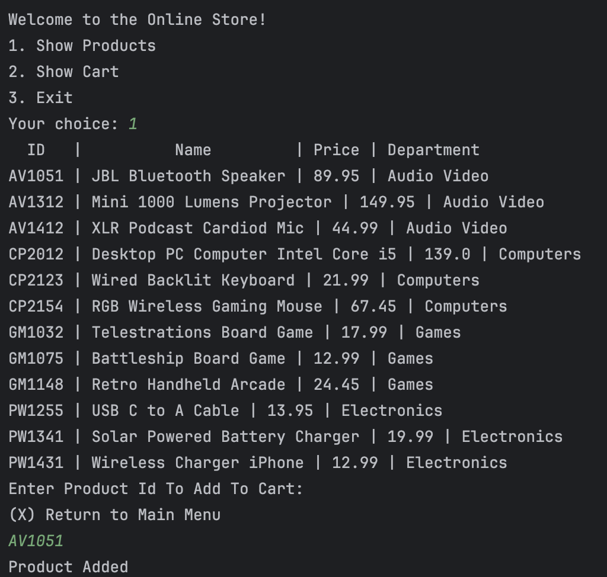
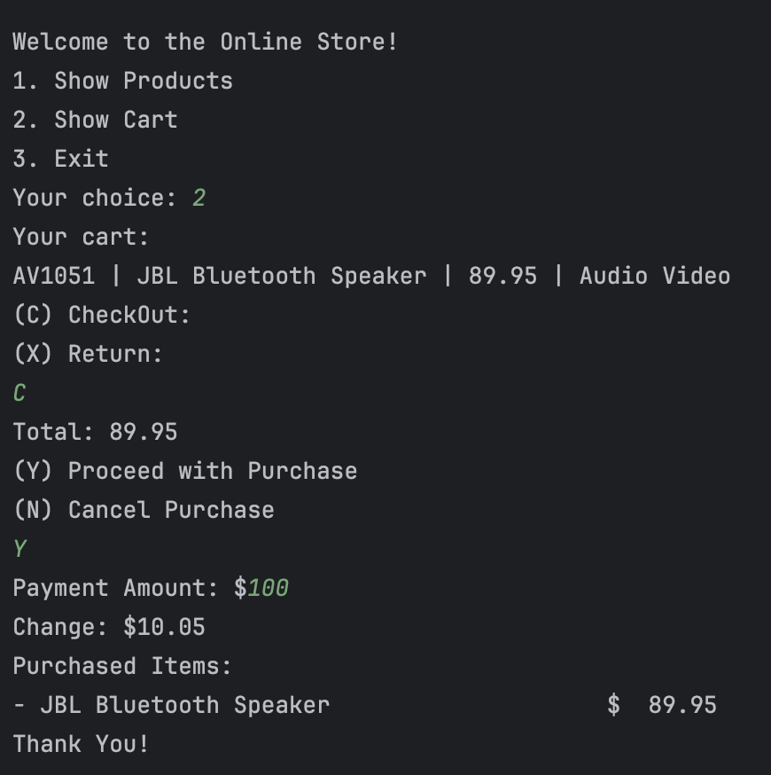

# 🛒 Online Store Application

## Description of the Project

The **Online Store Application** is a Java console-based project that simulates a simple shopping experience.  
It allows users to browse products, add or remove items from their shopping cart, and complete purchases using cash payments.  
After checkout, the system automatically generates a timestamped sales receipt and saves it inside a dedicated **Receipts** folder.

This project is designed for beginners and students learning **Object-Oriented Programming (OOP)** and **file handling in Java**, offering a hands-on introduction to fundamental programming concepts.

---

## Features

- 🧾 View all available products with unique IDs, names, and prices
- 🛒 Add or remove products from the shopping cart
- 💰 Calculate the total cost and handle cash payments
- 🧾 Display and save a detailed sales receipt after checkout
- 🗂️ Automatically create a `Receipts` folder if it doesn’t already exist

---

## User Stories

- As a customer, I want to see a list of main menu options when I open the store so that I can easily navigate to view products, view my cart, or exit the store.
- As a customer, I want to see all available products so that I can decide which items I might want to buy.
- As a customer, I want to search for a product by entering its SKU so that I can quickly find specific product details.
- As a customer, I want to add products to my shopping cart so that I can purchase them later during checkout.
- As a customer, I want to view all items currently in my shopping cart so that I can review what I plan to purchase and see the total cost.
- As a customer, I want to remove an item from my cart so that I can adjust my purchase before checkout.
- As a customer, I want to checkout and pay for my items so that I can complete my purchase.
- As a customer, I want a copy of my receipt saved as a file so that I can keep a record of my purchase.

---

## Setup

### Prerequisites

- IntelliJ IDEA: Ensure you have IntelliJ IDEA installed, which you can download from [here](https://www.jetbrains.com/idea/download/).
- Java SDK: Make sure Java SDK is installed and configured in IntelliJ.

### Running the Application in IntelliJ

Follow these steps to get your application running within IntelliJ IDEA:

1. Open IntelliJ IDEA.
2. Select "Open" and navigate to the directory where you cloned or downloaded the project.
3. After the project opens, wait for IntelliJ to index the files and set up the project.
4. Find the main class with the `public static void main(String[] args)` method.
5. Right-click on the file and select 'Run 'YourMainClassName.main()'' to start the application.

---

## Technologies Used

- Java: 17.0.16

## Demo

Below are example screenshots demonstrating various features of the application:

## Future Work

- When a customer adds multiple items to a cart 
    - Instead of showing the item multiple times, your cart should only display each item once, but display the quantity for each item
- Improvement of the UI.

## Resources

- [Potatoe Sensei](https://chatgpt.com/g/g-681d378b0c90819197b16e49abe384ec-potato-sensei)
- [Workbooks]

## Contributor

- Zain Ashraf

## Thanks

- Thank you to Raymond for continuous support and guidance.
- A special thanks to all teammates for their dedication and teamwork.
